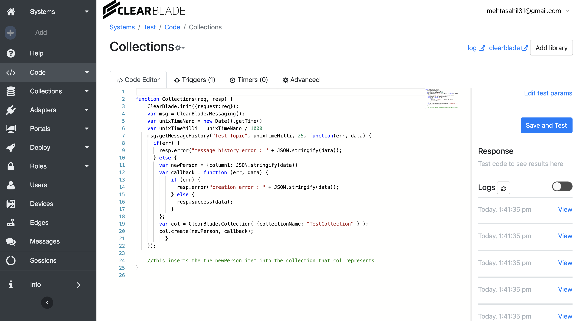
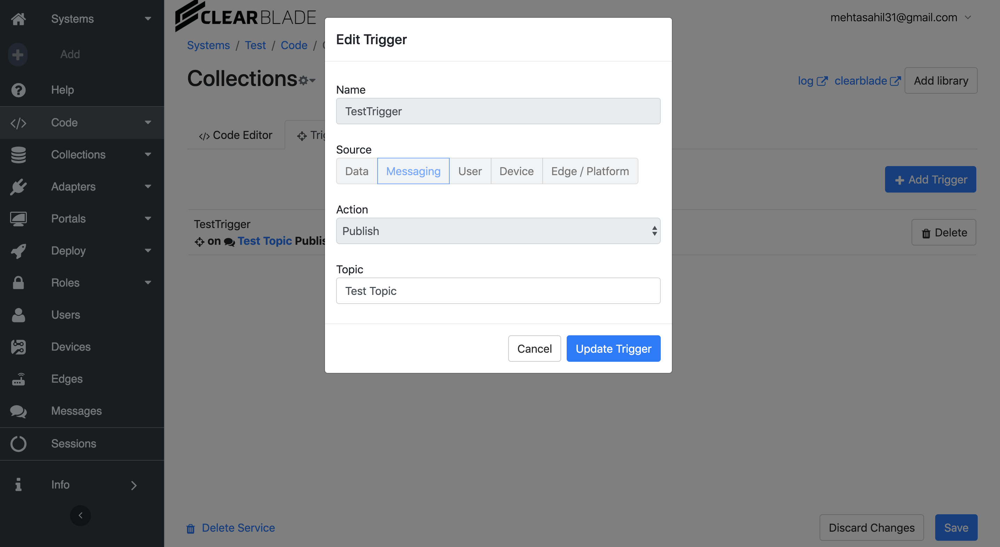
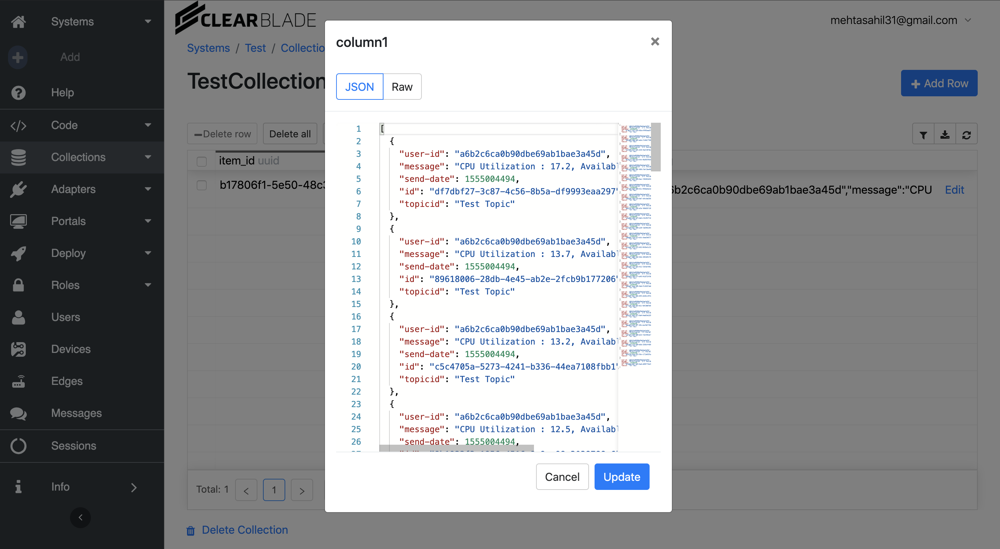

# ClearBlade

## Step 1

1. Firstly, I created an account on www.platform.clearblade.com
2. Selected Add system option and added an Empty system. 
3. Once a system is created, I selected that system. In the gear near the system name, I got System Key and System Secret from there.
4. Then I added a user from the Users menu and granted him Authenticated role.
5. Then I went in the roles menu and in the Authenticated/Message Topic section, I added a message topic and subscribed to that.

## Step 2

I installed ClearBlade-Python-SDK

	pip install clearblade

Before running the above code, we will have to set two environment varibales

	export SYSTEM_KEY='a0b1c6ca0b9cdb89d3f9ea82e86a'
	export SYSTEM_SECRET='A0B1C6CA0BE8F8DFA7ABF198A864'

I have used [psutil](https://psutil.readthedocs.io/en/latest/) python library to send the cpu status.

Then I ran the mqtt.py

	python mqtt.py
	

After this you should get the message (CPU Staus and Memory) on the ClearBlade platform

## Step 3

Now to store the received message in a collection.
1. I created a collection on ClearBlade Platform and allowed permissions for Authenticated Role.
2. Then I went to Services and created a code service.
3. Imported clearblade
4. The following code will add the message received in the collection.

But we needed to the code servide to add the message in the collection for every publish.
So I created a trigger, such that it will run the code service after every publish.

So when, I run the mqtt.py and it publishes the message on ClearBlade platform, the trigger is activated and the code service runs and the message is added to the collection.

I hope that answers all the questions. Thank you!
